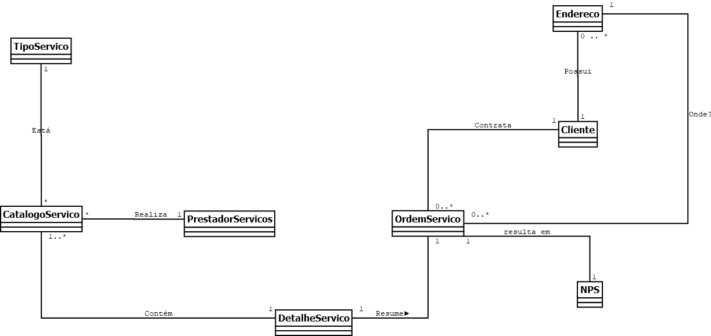
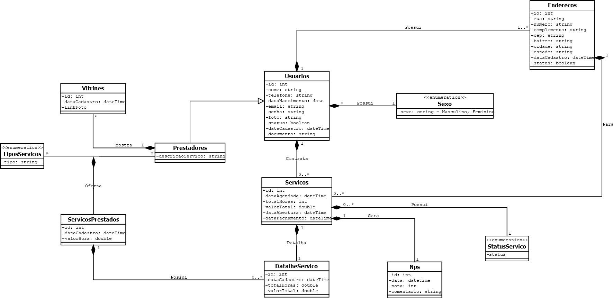

#  API FAZPRAMIM

## 📑️ ESCOPO

Faz Pra Mim é uma aplicação API RESTful desenvolvida em Java com Spring Boot, cujo objetivo é conectar clientes que precisam de pequenos serviços (ex: marido de aluguel, encanador, eletricista) com prestadores de serviço disponíveis.

O projeto oferece uma estrutura CRUD completa para gerenciar usuários, prestadores, serviços oferecidos, pedidos realizados e avaliações de satisfação (NPS).

## 🧑‍💻️ FUNCIONALIDADES

- Gestão de base de usuários (clientes);
- Gestão de base de prestadores de serviço (faz tudo);
- Promover a gestão de ordens de serviço (clientes vs prestadores);
- Gestionar os serviços prestados;
- Promover o NPS dos prestadores de serviço;

## 🛠️ TECNOLOGIA EMPREGADAS
- **Java 19** – linguagem de programação;
- **Spring Boot** – framework Java para desenvolvimento de aplicações;
- **Spring Data JPA** – módulo do Spring que facilita o trabalho com bancos relacionais usando a especificação JPA;
- **Validation** – processo que garante automaticamente que os dados recebidos atendam a regras definidas antes de serem processados ou armazenados;
- **Maven** – ferramenta de automação e gerenciamento de projetos Java que simplifica compilação, dependências e deploy;
- **JPA / Hibernate** – implementação da especificação JPA para mapeamento objeto-relacional;
- **MySQL** – banco de dados relacional;
- **Insomnia** – ferramenta para testes de integração e comunicação da API;
- **Flyway** – ferramenta para gerenciar e versionar mudanças no banco de dados.

## 🧠 MODELAGEM DE DOMÍNIO - REGRA DE NEGÓCIO

## 🛢️ BANCO DE DADOS - MODELO RELACIONAL

## 🚨 STATUS DO PROJETO: EM DESENVOLVIMENTO

- ✅ Planejamento de Escopo: Concluído!
- ✅ Modelagem de entidades do negócio: Concluído!
- ✅ Configuração de Conexão do Banco de Dados: Em desenvolvimento!
- 🚨 Implementação de GRUD de Prestadores: Em desenvolvimento!