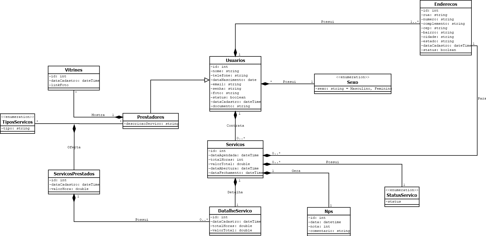

#  PROJETO FAZPRAMIM

## 📑️ ESCOPO

Faz Pra Mim é uma aplicação API RESTful desenvolvida em Java com Spring Boot, cujo objetivo é conectar clientes que precisam de pequenos serviços (ex: marido de aluguel, encanador, eletricista) com prestadores de serviço disponíveis.

O projeto oferece uma estrutura CRUD completa para gerenciar usuários, prestadores, serviços oferecidos, pedidos realizados e avaliações de satisfação (NPS).

## 🧑‍💻️ FUNCIONALIDADES

- Gestão de base de usuários (clientes);
- Gestão de base de prestadores de serviço (faz tudo);
- Promover a gestão de ordens de serviço (clientes vs prestadores);
- Gestionar os serviços prestados;
- Promover o NPS dos prestadores de serviço;

## 🛠️ TECNOLOGIA EMPREGADAS
- Java 19
- Spring Boot
- Sprong Data JPA
- Validation
- Maven
- JPA / Hibernate
- Banco de Dados Relacional MySQL
- Insomnia
- Flyway

## 🧠 MODELAGEM DE REGRA DE NEGÓCIO

## 🚨 STATUS DO PROJETO: EM DESENVOLVIMENTO

- ✅ Planejamento de Escopo: Concluído!
- ✅ Modelagem de entidades do negócio: Concluído!
- ✅ Configuração de Conexão do Banco de Dados: Concluído!
- ⏳ Implementação de Usuarios: Em andamento!